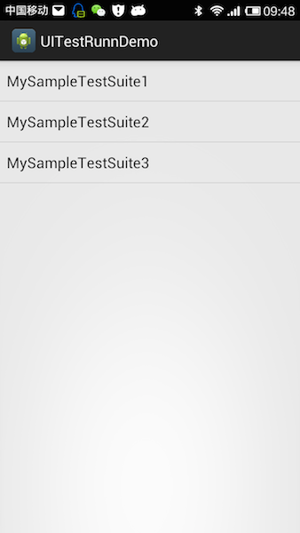
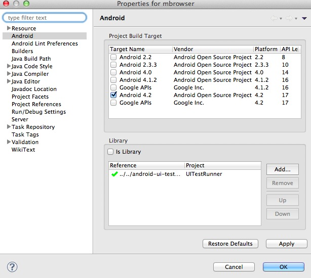
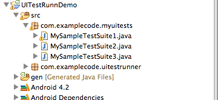
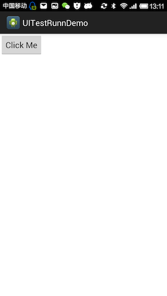
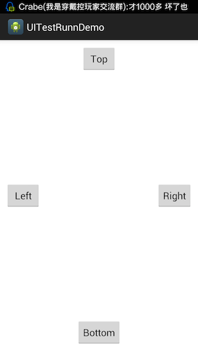

# Android UITestRunner 

这是一个非常简单的测试框架，帮助我们测试一些UI相关的用例，通常情况下我们使用Junit编写单元测试只是针对没有界面的非UI用例，而对于和界面相关的逻辑操作测试起来就不太方便，比如我只想看看这个界面的运行效果，看看界面的布局是否达到预期 Junit就满足不了我们的要求。通常我们不得不创建一个很小的demo来演示我们的界面，那么UITestRunner就是帮助android开发者解决类似的问题的，其实他就是你需要的那个很小的demo,只是他更加方便的以类似JUnitTest的方式把你的所有用例组织起来（你只要写一个以“test"开头的方法即可），并且把这些用例以列表的方式显示出来，测试其中一个用例，只需要点击列表项即可。

  


## 在你的项目中使用UITestRunner

### step1 导入UITestRunner到Eclise的工作空间

UITestRunner需要和你要测试的项目在同一个workspace,首先我们需要把它导入到我们所在的workspace.

按照以下的步骤操作：

    File -> Import -> Existing Android Code Into WorkSpace

### step2 在你的项目中设置依赖 UITestRunner
UITestRunner 是以lib类型的工程存在，我们必须设置我们的项目依赖UITestRunner.
按照以下步骤操作：
    
    选择你的项目 -> 选择Properties(右键菜单) -> 选择Android 

这时候你会看到下面这个界面,点击Add把UITestRunner添加进来。 

 


### step3 添加UITestRunner的声明

在你自己项目的AndroidManifest.xml中添加以下内容声明UITestActivity(测试用例的展示界面)

```
    <activity android:name="com.mmbox.uitestrunner.UITestActivity">
        <intent-filter>
            <action android:name="com.mmbox.uitestrunner.Main" />
            <category android:name="android.intent.category.DEFAULT" />
        </intent-filter>
    </activity>
```

### step4 创建你自己的测试套件

你可以根据不同的测试类型创建多个测试套件，创建测试套件很简单只需要创建一个Class从UITestSuite继承即可。建议我们创建一个package来存放所有的测试套件(不是必须只是为了清楚易于维护，包名可以自己定义), 如下图所示:

 


测试套件的实现代码如下所示：

``` java
    

    public class MySampleTestSuite1 extends UITestSuite {
        
        public MySampleTestSuite1(Context context) {
            super(context);
            // TODO Auto-generated constructor stub
        }
    }

```

### step6 为已有的测试套件添加测试用例

添加测试用例很简单，只需要在测试套件中增加一些以 "test" 开头的 public 方法即可，如以下代码：

``` java

    public class MySampleTestSuite1 extends UITestSuite {
        public MySampleTestSuite1(Context context) {
            super(context);
            // TODO Auto-generated constructor stub
        }
        
        public void testSayHello() {
            Toast.makeText(getContext(), "Hello UITestRunner",Toast.LENGTH_SHORT).show();
        }
        
        public void testCase1InTestSuite1() {
            Toast.makeText(getContext(), "testCase1InTestSuite1 is runngin",Toast.LENGTH_SHORT).show();
        }
        
        public void testCase2InTestSuite1() 
        {
            Toast.makeText(getContext(), "testCase2InTestSuite1 is runngin",Toast.LENGTH_SHORT).show();
        }
        
    }

```


### step5 启动测试用例

完成以上步骤就可以通过eclise安装项目到你的设备或模拟器中了，启动测试用例很简单只需要输入下面的命令即可.

    adb shell am start -a com.mmbox.uitestrunner.Main

一切正常的话你将会看到下面的界面:


## 在测试用例中测试一个View的布局显示

我们除了在测试用例测试一些简单的逻辑外，还有一个经常需要的场景就是想看看一个布局文件的实际显示效果，这时候我们没有必要创建一个新的Activity来显示你的View，只需要在测试用例中调用showTestView方法即可. 框架提供了两个方法 showView,showLayout，分别用于显示一个View实例和展示一个布局文件。


### 显示一个view实例

``` java

    public void testShowSimpleButton() {
        Button btn = new Button(getContext());
        btn.setText("Click Me");
        btn.setLayoutParams(new ViewGroup.LayoutParams(ViewGroup.LayoutParams.WRAP_CONTENT, ViewGroup.LayoutParams.WRAP_CONTENT));
        showView(btn);
    }

```




### 显示一个布局文件

``` java

    public void testShowSimpleLayout() {
        showLayout(R.layout.show_layout_demo);
    }

```




